# The Agility Secure AWS Files App

A powerful Next.js app for Agility CMS that enables secure file and directory management using AWS S3. Content editors can upload files, browse directories, and select entire directories for dynamic content like image galleries.

## Features

- 🔐 **Secure File Storage**: Upload and store files securely in AWS S3
- 🗂️ **Directory Selection**: Select entire directories for dynamic content
- 📁 **Directory Navigation**: Browse and navigate through S3 directory structures  
- 🔒 **Time-Limited URLs**: Generate secure URLs with automatic expiration
- 🖼️ **Dynamic Content**: Enable dynamic file listings, galleries, and document libraries
- 📄 **File Type Filtering**: Support for images, documents, videos, and more
- ⚡ **Developer-Friendly**: Client-side utilities for easy integration

## 🚀 Quick Start

### Field Configuration

Add the AWS S3 field to your content type definition:

```typescript
{
  "name": "filesDirectory",
  "label": "Files Directory", 
  "type": "aws-secure-file",
  "allowDirectorySelection": true
}
```

### Directory Selection

Content editors can:
1. Navigate to the desired directory
2. Click "Select This Directory" 
3. Save the directory path for developers to use

## 🛠️ Developer Integration

### Basic Directory Contents

```typescript
import { getDirectoryContents } from '@/lib/directory-utils';

// Get all files in a directory
const { files } = await getDirectoryContents({
  bucketName: 'your-bucket',
  accessKeyId: 'your-key',
  secretAccessKey: 'your-secret',
  region: 'us-east-1',
  directoryPath: 'images/gallery-2024/'
});
```

### Using Directory Selection in Your App

```typescript
// In your front-end application
import { getDirectoryContents } from '@/lib/directory-utils';

// Get the directory path from your Agility CMS field
const directoryField = item.fields.galleryDirectory; // Selected via CMS
const directoryPath = directoryField.fullPath;

// Fetch all files in the selected directory
const { files } = await getDirectoryContents({
  bucketName: process.env.AWS_BUCKET_NAME!,
  accessKeyId: process.env.AWS_ACCESS_KEY_ID!,
  secretAccessKey: process.env.AWS_SECRET_ACCESS_KEY!,
  region: process.env.AWS_REGION!,
  directoryPath: directoryPath
});

// Build your own gallery, file list, or any other component
```

### Directory with Secure URLs

```typescript
import { getDirectoryWithSecureUrls, getImageFiles } from '@/lib/directory-utils';

// Get all files with time-limited secure URLs
const filesWithUrls = await getDirectoryWithSecureUrls({
  directoryPath: directoryField.fullPath,
  bucketName: process.env.AWS_BUCKET_NAME!,
  accessKeyId: process.env.AWS_ACCESS_KEY_ID!,
  secretAccessKey: process.env.AWS_SECRET_ACCESS_KEY!,
  region: process.env.AWS_REGION!
});

// Filter by file type if needed
const images = getImageFiles(filesWithUrls);
const documents = getDocumentFiles(filesWithUrls);
```

### Directory Metadata

```typescript
import { getDirectoryInfo } from '@/lib/directory-utils';

// Get directory statistics
const info = await getDirectoryInfo({
  directoryPath: 'documents/',
  // ... other config  
});

console.log(`${info.fileCount} files, ${info.totalSize} bytes`);
```

## 📁 Field Value Format

### File Selection (Traditional)
```json
{
  "name": "image.jpg",
  "type": "file",
  "properties": {
    "etag": "d41d8cd98f00b204e9800998ecf8427e",
    "lastModified": "2024-01-15T10:30:00Z",
    "contentLength": 1024000,
    "contentType": "image/jpeg"
  },
  "label": "Product Image"
}
```

### Directory Selection (New)
```json
{
  "name": "gallery-2024",
  "type": "directory", 
  "fullPath": "images/gallery-2024/",
  "label": "2024 Photo Gallery",
  "metadata": {
    "fileCount": 25,
    "totalSize": 10485760,
    "lastModified": "2024-01-15T10:30:00Z"
  }
}
```

## 🔧 API Endpoints

### Get Directory Contents
```
GET /api/get-directory-contents?path=images/gallery/&bucketName=...
```

Returns all files within a directory (including subdirectories).

### Get Directory Info  
```
GET /api/get-directory-info?path=images/gallery/&bucketName=...
```

Returns metadata about a directory (file count, total size, last modified).

### Get Secure File URL
```
GET /api/get-secure-url?bucketName=...&blobName=...
```

Generates a time-limited secure URL for a specific file.

## 🎨 UI Components

### FileListing
Handles file browsing and directory selection with search and pagination.

### DirectoryRow  
Displays directory information with selection and navigation options.

### Breadcrumbs
Shows current path with quick selection buttons for any directory level.


## 🔐 Security

- All file access uses time-limited secure URLs (10 minute expiration)
- AWS credentials are never exposed to the client
- Directory access is controlled by AWS IAM permissions  
- File uploads are authenticated and authorized

### Security Flow

The security model ensures files cannot be accessed without proper credentials:

```mermaid
graph TD
    A[Client Has File Path from CMS] --> B{Has AWS Credentials?}
    B -->|No| C[❌ Cannot Access File]
    B -->|Yes| D[Call /api/get-secure-url]
    D --> E[Server Generates Presigned URL]  
    E --> F[✅ 10-Minute Temporary URL]
    F --> G[URL Expires - Access Denied]
```



**Key Security Features:**
- 🔒 Private S3 buckets (no public access)
- 🕐 Short-lived presigned URLs (10 minutes)
- 🔑 Server-side credential management
- 🚫 File paths alone are useless without credentials

## 📝 Configuration

Required environment variables:
```env
AWS_ACCESS_KEY_ID=your_access_key
AWS_SECRET_ACCESS_KEY=your_secret_key  
AWS_REGION=us-east-1
AWS_BUCKET_NAME=your-bucket-name
```

## 📖 Documentation

- [Full Documentation](https://agilitycms.com/docs/apps/secure-files-aws)
- [Directory API Reference](./docs/directory-api.md)
- [Component Examples](./docs/component-examples.md)

## 🤝 Contributing

1. Fork the repository
2. Create a feature branch
3. Make your changes
4. Test thoroughly 
5. Submit a pull request

## 📄 License

This project is licensed under the MIT License.